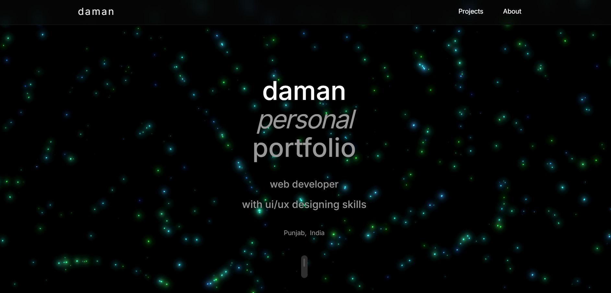
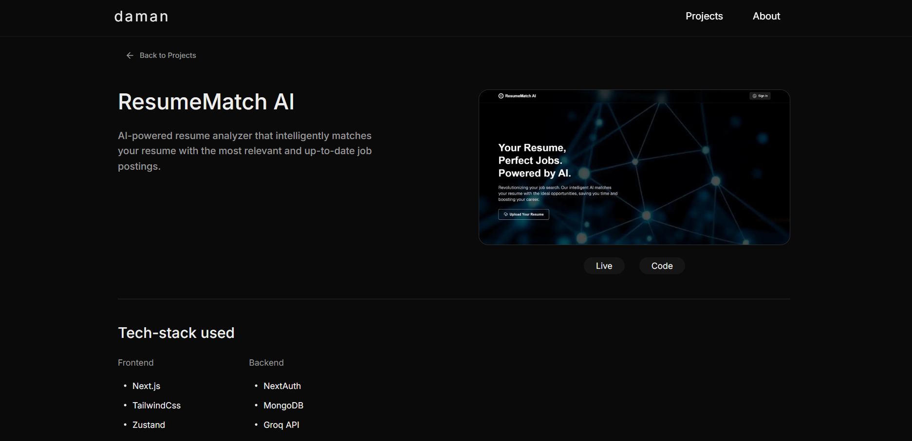
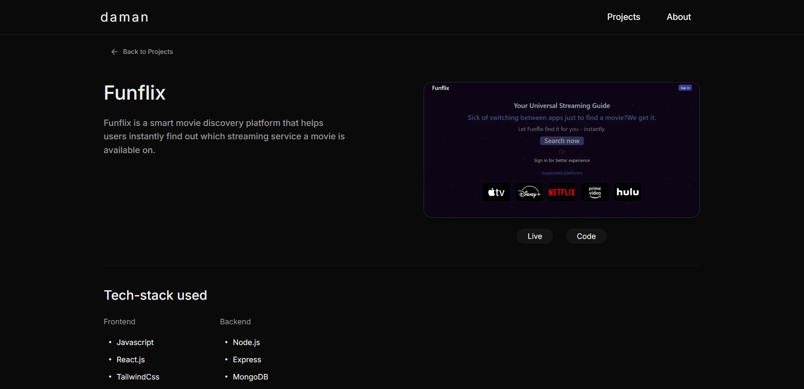

## 🚀 Daman | Portfolio

A modern and responsive developer portfolio built with Next.js, React, and Tailwind CSS.
This portfolio showcases my projects, skills, and passion for creating sleek, user-friendly web applications.

## ✨ Features

- 🎨 Modern UI/UX – clean design with smooth animations
- 📱 Responsive Design – optimized for mobile, tablet, and desktop
- ⚡ Next.js & React – fast, SEO-friendly, and scalable
- 🔍 SEO Optimized – metadata + Open Graph for better visibility
- 🖼️ Optimized Images – using Next.js <Image /> for performance
- 🖱️ Smooth Scroll – seamless navigation experience

## 🛠️ Tech Stack

- Framework: [Next.js](https://nextjs.org)
- Styling: [Tailwind CSS](https://tailwindcss.com)
- Icons: [Lucide React](https://lucide.dev/guide/packages/lucide-react)
- Deployment: [Vercel](https://vercel.com)

## 🚀 Getting Started

1️⃣ Clone the repo

```bash
git clone https://github.com/daman599/Portfolio-website.git
cd portfolio
```

2️⃣ Install dependencies

```bash
npm install
```

3️⃣ Run the dev server

```bash
npm run dev
```

Now open http://localhost:3000 🎉

## 📸 Screenshots

Landing Page

<div align="center">
  
</div>

Projects Section

<div align="center">
  
  


## 📬 Contact

👨‍💻 Daman

- Portfolio: https://your-portfolio-link.com
- GitHub: https://github.com/daman599
- Twitter: https://x.com/daman76752

